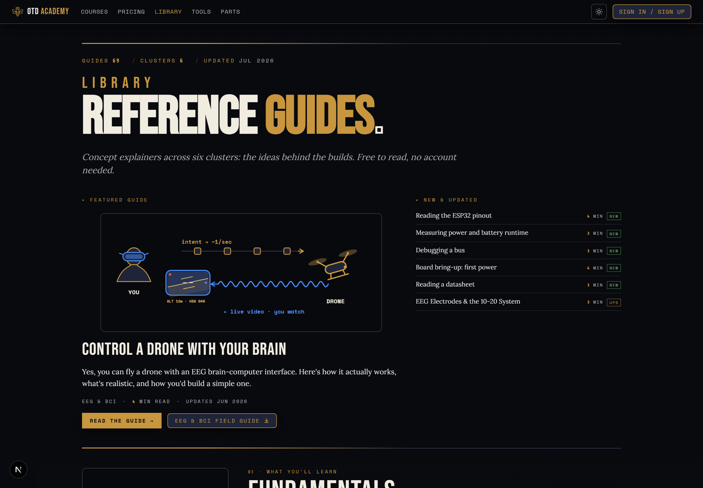
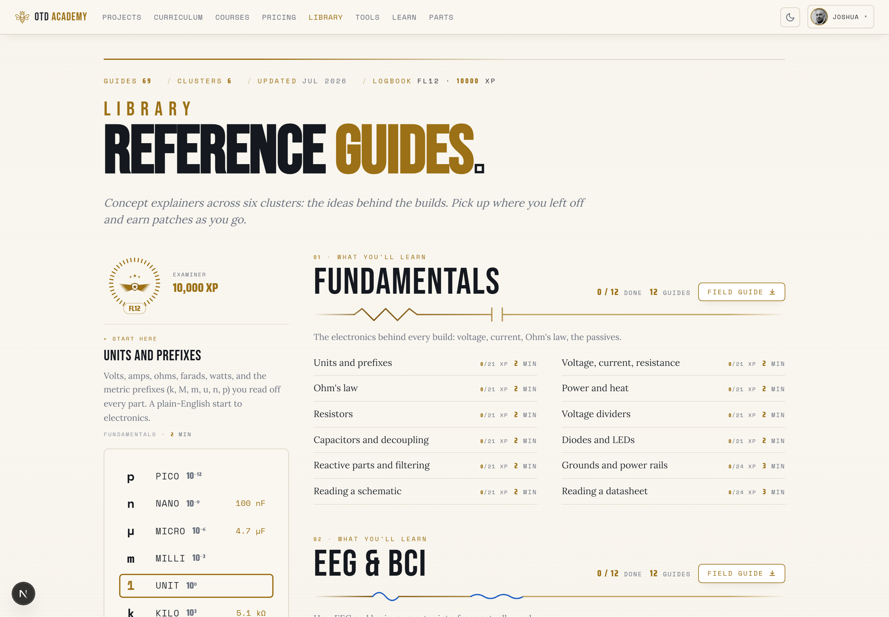
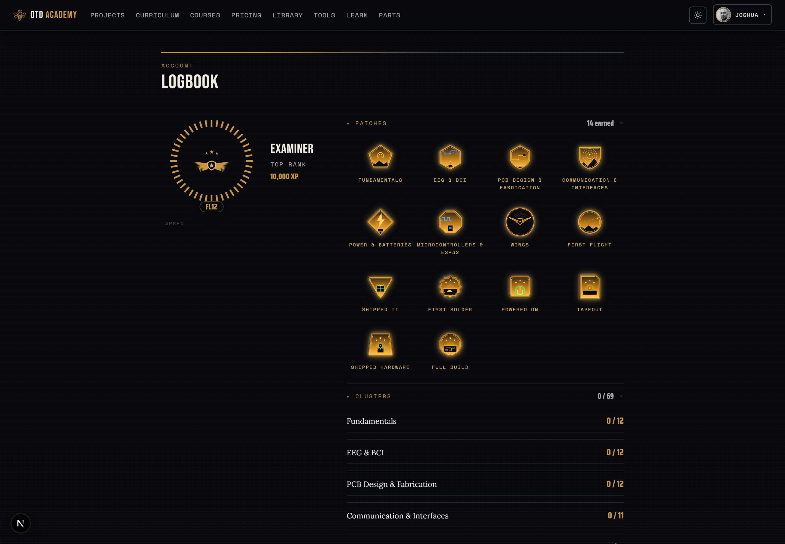
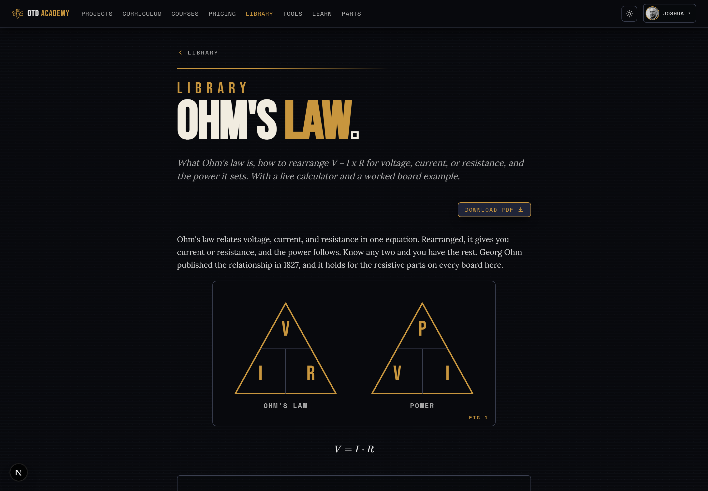

# One Thousand Drones Academy

> **License:** All rights reserved. See [LICENSE.md](LICENSE.md). This repo is public for transparency, reference, and portfolio purposes; the code is **not** licensed for use, fork, or derivative work by anyone other than the copyright holder.

**Production:** https://academy.onethousanddrones.com

**Repo:** https://github.com/otd-llc/otd-academy (package name `otd-academy`).

An online hardware-engineering academy. Learners design real PCBs and electronics — requirements, BOM sourcing, schematic, layout, fabrication, and bring-up — by following interactive, stage-by-stage build-guide courses. The flagship curriculum is a deliberate ESP32-WROOM teaching ladder that climbs from a USB-C breakout to an 8-channel biopotential front-end.

The same engine that tracks a real hardware project's lifecycle backs the learning experience: every guide card's "done" verdict is computed from the *real* engineering stage-gate, so a learner can never mark a step complete while the underlying gate is still closed.

## Screenshots

Dark is primary; every surface also flips to a warm-ivory light theme (shown: the signed-in library).

| The Library (`/library`) — a magazine index of reference guides | Signed in — a resume card, XP ring, and per-section schematic heads (light) |
| :---: | :---: |
| [](docs/screenshots/library-public-dark.png) | [](docs/screenshots/library-student-light.png) |
| **The Logbook** (`/logbook`) — rank, XP, and mission-patch badges | **A reference lesson** — a live (bare) diagram, typeset math, and a build-fresh PDF |
| [](docs/screenshots/logbook-dark.png) | [](docs/screenshots/lesson-dark.png) |

## What it does

Each course is a hardware project moved through nine workflow stages, with first-class state, server-enforced gates, and an append-only audit trail:

```
REQUIREMENTS → BOM_SOURCING → SCHEMATIC → LAYOUT → DRC_GERBER → ORDERING → ASSEMBLY → BRINGUP → REVISION
```

Some gates are strict invariants (you cannot enter `LAYOUT` before the BOM is frozen; advancing into `REVISION` freezes the revision and its active Build atomically). Others are existence checks that tighten as KiCad-parsing and distributor-API integration land.

On top of the workflow engine sit the learner-facing layers:

- **Courses & curriculum DAG.** Projects carry curriculum metadata (`track`, `level`, `criticalPath`, `disciplineTaught`, `requiresStripboard`, `hasMainsNet`) and are wired into a dependency graph via `ProjectDependency` edges (`DE_RISK` / `FOUNDATION` / `SHARED_BLOCK`). A per-advance dependency gate blocks a project from advancing while its prerequisites haven't reached the required stage; an advisory-locked cycle-check keeps the graph acyclic on edge insert. The seeded ESP32 curriculum is 22 projects / 33 edges (16 boards across SENSE/ACT/POWER/COMMS tracks + 6 bench tools), visualized at `/curriculum` and indexed for the public at `/courses`.
- **Learner guides.** Each revision can carry a `Guide` of per-stage `GuideCard`s that walk a learner through *building* that board: teaching content as typed JSON blocks (prose, callouts, steps, tables, diagrams, 3D part models, glossary terms) plus a uniform stage-gate footer. Guides are composed from templates (per-stage skeletons + per-track overlays + per-project safety gotchas) and materialized per revision. Served at `/projects/[slug]/[revLabel]/guide`.
- **Per-user progress.** Open registration via **Google or GitHub OAuth, or an email magic-link** (Resend); accounts auto-link by verified email. A learner enrolls in the shared curriculum, progresses on their *own* track gated by per-user quizzes and proof artifacts, earns recorded grades, and can take an optional server-scored board exam that confers mastery. Completion (not the exam) unlocks dependent boards through the DAG. Signed-in learners get an account avatar (seeded from the OAuth provider, or a custom cropped upload) and a light/dark theme that follows the account.
- **Reference surfaces, buying & credentials.** Beyond courses, the public SEO surface includes a magazine-style `/library` of mini-lessons across six clusters (each cluster a downloadable **Field Guide** PDF lead-magnet), a `/glossary`, and `/tools` electronics calculators (with embeddable widgets). Signed-in learners get a **Logbook**: XP for lessons and quizzes, a 12-rank ladder, and collectible mission-patch badges, surfaced by a milestone fanfare and per-answer "+XP" ticks. A stage's BOM is **live-buyable** — per-line DigiKey price + stock with one-click cart add. Finishing a lesson issues a **certificate**: a shareable PDF (embossed seal) recorded in a public `/verify` registry; lessons, guides, and the combined field guide also export to print-ready PDFs (rendered from the live content — see [Notable engineering](#notable-engineering)).
- **Parts knowledge base.** A curated, citation-backed parts library (pinouts, parametrics, power, derating, mechanical) with verified-vs-unverified trust levels. Browsable at `/parts` (public for SEO), and exposed read-only to AI sessions over a standalone MCP server (see [`mcp/parts-server/`](mcp/parts-server/)).
- **KiCad export.** A revision's BOM exports to a KiCad 10 project zip — merged symbol library, footprints, pre-wired symbol↔footprint associations, and a per-part asset-coverage report. Parts without curated CAD assets get loudly-marked placeholder stubs so the project still opens.

## Notable engineering

A few pieces that were more interesting to build than a content site implies:

- **Diagrams are responsive React components with a print pipeline — not bitmaps.** The ~80 guide diagrams are hand-authored SVG React components behind a registry, rendered live in a lesson through a shared `DiagramFrame`. They reflow between a landscape "scene" and a portrait "stack" using **container queries** keyed off the *frame's* own width, not the viewport — so one diagram reads large in a narrow follower-card rail and wide in a lesson body, with no viewport-media guesswork. A **Playwright** exporter (`pnpm diagrams:export`) drives an internal `/diagram-render/[key]` route and screenshots each diagram to an indexable `.webp` (dark; OG cards + SEO) plus a `-light.png` (print). In-lesson and print render a *bare* variant (a `?bare=1` context strips the echoed title/eyebrow/caption); the standalone exported image keeps them.

- **Field Guide PDFs render from the live content, with zero export drift.** The per-lesson and combined "field guide" PDFs are built with **`@react-pdf/renderer` from the same typed `contentBlocks` the web page renders** — no separate authoring or export step, so a content edit appears in the PDF on the next request. It is a warm-ivory print document (bundled print faces, a 135° gradient-alpha brandmark watermark, dynamic `render`-callback page numbers) with each diagram embedded as its bare light raster.

- **Real typeset math in the PDF — no browser, no native rasterizer.** react-pdf can't run KaTeX (it emits HTML), and the serverless target can't `dlopen` a native image codec, so equations are rendered with **MathJax → SVG** (`fontCache: 'none'`, so every glyph is an inline `<path>` and there are no `<use>`/`<defs>` react-pdf won't resolve) and then **translated node-by-node into react-pdf `<Svg>/<G>/<Path>/<Rect>` primitives** ([`src/lib/pdf/math-svg.tsx`](src/lib/pdf/math-svg.tsx)). A plain-ASCII fallback keeps one bad equation from ever crashing a document. (On-page math still uses **KaTeX** directly.)

- **Server-enforced stage gates, not UI hints.** A guide card's "done" verdict is computed from the *real* engineering stage-gate (frozen BOM, DRC-clean Gerbers, a passing checklist), inside Serializable transactions with append-only audit — so the teaching layer can never mark a step complete while the underlying gate is closed, and a curriculum dependency gate holds a board until its prerequisites are reached.

## Access tiers & monetization

Projects carry an `accessTier`. **Public** lessons are readable signed-out (the free funnel + SEO surface); **premium** lessons are gated behind a per-project one-time purchase (no subscription). Purchases are recorded as `Entitlement`s, fulfilled via Stripe Checkout + webhook (idempotent, deduped through `ProcessedStripeEvent`). A `WaitlistSignup` captures interest on not-yet-released courses. Stripe is optional at the env level — the payment client is lazily constructed and only throws when actually invoked, so builds and CI run with no keys.

## Domain model (one-screen summary)

- **Project** — a course / hardware project. Slug, optional `repoUrl` (external KiCad repo), `accessTier`, `publishedRevisionId`, and curriculum fields (`track`, `level`, `criticalPath`, `disciplineTaught`, `requiresStripboard`, `hasMainsNet`).
- **ProjectDependency** — a directed curriculum edge (`dependent → dependsOn`) with a `kind` and the stages it gates on. Unique on `(dependentProjectId, dependsOnProjectId, dependentStageGated)`.
- **Revision** — a specific rev (`v1`, `v1.1`). Carries `currentStage`, `bomFrozenAt`, `frozenAt`, `schematicCommit`, `layoutCommit`. Has 0..N Builds.
- **Build / Board** — a fabrication run of N boards (`BUILD-001`) and each physical board (`B01`..`Bn`, status `BARE → … → BROUGHT_UP` plus `FAILED`/`QUARANTINED`). At most one unfrozen Build per Revision (partial unique index).
- **Artifact** — polymorphic (FILE / NOTE / LINK) with typed `subkind`; scoped to a Revision XOR a Build (raw CHECK).
- **Checklist + ChecklistItem / Measurement** — structured execution records. Canonical templates (`REQUIREMENTS_REVIEW`, `LAYOUT_REVIEW`, `STRIPBOARD_VALIDATION`, `POST_ASSEMBLY_CONTINUITY`) feed the matching stage exit-gate. Measurements are per-Board DMM/scope readings.
- **Guide + GuideCard** — revision-scoped teaching layer (one Guide per Revision). Each card is stage-tagged, ordered, holds Zod-validated `contentBlocks` + an optional `completionRef` backing its gate. The guide adds no new gate logic — it reuses the stage gates and the checklist/measurement substrate.
- **Part / BomLine / PartFact / PartAsset** — global parts library keyed by `(manufacturer, mpn)`, with cited facts, a category tree, and CAD assets (KiCad symbol/footprint/3D, convert-at-upload to `.glb` for the in-app viewer).
- **Enrollment / QuizPass / Exam / ExamResult** — per-user learning progress, grades, and optional mastery exams.
- **Entitlement / WaitlistSignup / ProcessedStripeEvent** — purchases, waitlist interest, and Stripe webhook dedupe.
- **Erratum** — defect captured against a Revision; the only post-freeze write path.

## Relationship to external KiCad repos

The academy **does not** hold KiCad project files. Each hardware project lives in its own external git repo — schematics, layouts, Gerbers, BOMs, bench docs. The academy stores pointers and pins: `Project.repoUrl`, `Revision.schematicCommit`, `Revision.layoutCommit`, and `Board.silkscreenHash` (the git SHA printed on the physical PCB silkscreen, captured at screening). So the academy tracks **workflow, state, audit, curriculum, guides, and progress**; the external repo tracks **design files and version history**.

## Tech stack

- **Next.js 16** (App Router, RSC + client islands) · **TypeScript 5** · **React 19**
- **Prisma 7 + Neon Postgres** via `@prisma/adapter-neon` (a pooled connection at runtime, a direct one for migrations)
- **Auth.js v5** — Google + GitHub OAuth and a Resend email magic-link (accounts auto-link by verified email), JWT sessions; open self-serve registration with role-based authorization (`ADMIN` / `LEARNER`)
- **Stripe** for one-time premium-course purchases (Checkout + idempotent webhook)
- **Tailwind v4** (CSS-first `@theme`, no JS config) — hand-rolled components, no component framework; Radix UI primitives for the accessible tooltip/glossary. Dark and light themes (toggle, persisted per account), command-gold brand, a four-face type stack (Bebas Neue / Saira Condensed / Space Mono / Lora), inline SVG icon set
- **Cloudflare R2** for file artifacts, CAD assets, and user avatars (presigned PUT/GET, server `HEAD`-after-PUT verification; avatars cropped client-side with react-easy-crop)
- **three.js** for the in-app 3D CAD viewer
- **`@react-pdf/renderer`** for every PDF (certificate, per-lesson, combined field guide), rendered from the live typed content so there is no export step to drift; **MathJax** (`mathjax-full`) renders equations to SVG that is translated into react-pdf primitives for print, while **KaTeX** renders math on the page
- **Playwright** (headless Chromium) exports each SVG diagram *component* to an indexable `.webp` + a print `.png` via an internal render route (`scripts/export-diagrams.ts`)
- **Resend** for transactional (magic-link sign-in) + lifecycle email
- **PostHog** for product analytics (a hard no-op when unconfigured — no init, no network)
- `sanitize-html` for note-body / guide-prose sanitization
- **Vitest** for the test suite; CI runs `tsc` + `build` + `migrate` + tests against a Neon CI branch (live-R2 / MCP tests are env-gated out of CI)

## Local development

Requires **Node 20+** and **pnpm**.

```bash
pnpm install
cp .env.local.example .env.local   # then fill in real values
pnpm prisma migrate deploy
pnpm db:seed                                           # demo fixture (esp32-sensor-breakout)
pnpm exec tsx scripts/populate-curriculum-dag.ts       # the 22-project curriculum + 33 edges
pnpm exec tsx scripts/materialize-curriculum-guides.ts # a guide per curriculum revision
pnpm dev
```

Open http://localhost:3000.

`pnpm db:seed` produces a demoable fixture: `esp32-sensor-breakout` at v1 / BRINGUP, BUILD-001 with 5 ASSEMBLED boards, sample measurements, and the artifacts needed to drive the `BRINGUP → REVISION` advance end-to-end. The two `scripts/*.ts` populators are idempotent one-offs that add the curriculum projects/edges and their guides; they write via Prisma directly because the server-action layer can't be driven headlessly (it needs an Auth.js request context).

Env vars: copy [`.env.local.example`](.env.local.example) to `.env.local` and fill in the values — that file is the authoritative list. It covers the Neon database, Auth.js + Google OAuth, the admin allowlist, and the optional file-storage / payments / parts-MCP groups. Values are never committed.

## Tests

```bash
pnpm exec vitest run
```

Most tests hit a real Postgres. DB-backed test files run **in parallel**, each leasing its own Neon branch from a pre-provisioned pool (`.env.test.local` → `TEST_DATABASE_POOL`), so the action layer's Serializable-transaction contention never collides across workers and the suite finishes in ~80s (pure-logic files run poolless). Without `.env.test.local` the suite falls back to the `.env.local` database. Negative-insert tests cover the raw-migration CHECK constraints and unique indexes: if `prisma migrate deploy` drops a constraint, the corresponding test fails. CI runs `tsc` + `build` + `migrate` + tests against a dedicated Neon CI branch.

## Production deployment

- **Host:** Vercel (auto-deploys on push to `main`).
- **DB:** Neon Postgres (one branch is prod; PR previews can spin per-branch databases).
- **Domain:** `academy.onethousanddrones.com` is the primary host (CNAME → Vercel at Porkbun). The legacy `foundry.onethousanddrones.com` host redirects to `academy.` at the Vercel domain level, and old `/projects/foundry-<slug>` URLs 308-redirect to their prefix-free form (`src/lib/legacy-slug-redirect.ts`) so indexed/bookmarked links keep resolving.
- **Auth:** Google + GitHub OAuth apps + a Resend sender; redirect URIs / callbacks registered for localhost and the prod host.
- **Build:** `prisma generate && next build` — the `prisma generate` step is load-bearing (Vercel's clean install needs it to populate `@prisma/client` types before the TypeScript pass).

## For collaborators (including AI agents)

If you are reading this repo to understand the system rather than to operate it:

1. **Design decisions** live in [docs/plans/](docs/plans/) (design + implementation docs, one task per commit). **Current behaviour** is the code under `src/`, `mcp/`, and `prisma/` — if the code disagrees with a doc, the code wins.
2. **Don't fork or derive, and don't train models on this repo.** Per [LICENSE.md](LICENSE.md) you may read and cite the code; you may not copy any portion into another project or use it as ML training data.
3. **You cannot run live tests against the production database.** Tests run against a Neon CI branch; local dev points at a dev Neon branch via `.env.local`.
